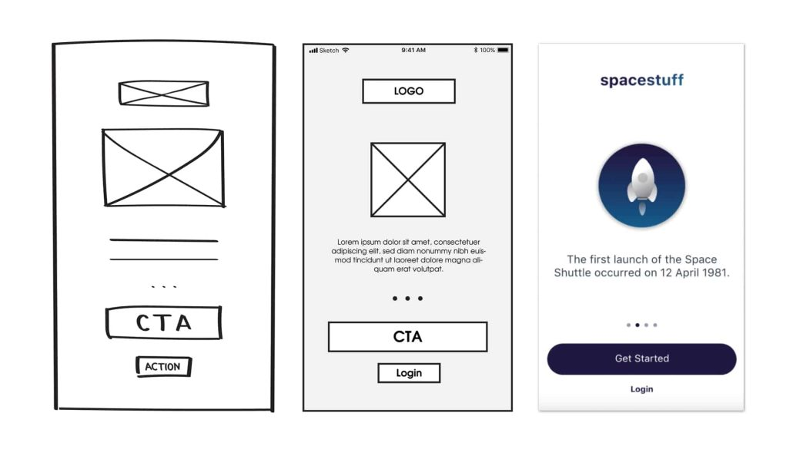

# user interface and user expreience

### product life cycle
1. Questions and gathering information from the user
2. searching and planning(creting work schedule)
3. design (look for designsالتغذيه البصريه)
4. choose design platform (figma, adobeXd)
5. development(e:g from scratch or webflow)
6. testing
7. depoloyment
8. maintainance

### UX
- UX come before UI, UI is a part of UX

### gathering information
- name of product
- product type(websit, application, android and ios)
- goal of product
- user of product
- lang to be used
- colors to be used
- similar websites design
- similar services

### planning
- time table

> [!NOTE]
> network effect: is the ability of a specific application or business to get more users from other users

### minimum viable product

### user flow
- using figma

### site map
- more detailed user flow, includeing each page and each page contents, features and design

### UI components
1. input controls

input fieds, checkboxes, radio button

2. navigatin componenet

search bar, pagination, tags

3. information component

padges of notifications, dialog

4. container

### android and ios UI systems

**search in google:-**

- android ui design system
- ios ui design system
- the standard way of android components design is called **material design** 

### wireframes
- initial design
    - low fedility wireframe
    minimum details desing in papers
    - high fedility wireframe

    

### prototype
- enable user to visualize the website dynamics