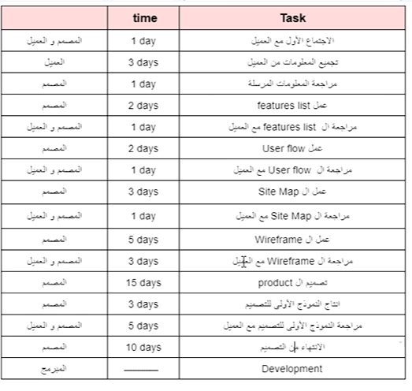

# user interface and user expreience

### product life cycle
1. Questions and gathering information from the user
2. searching and planning(creting work schedule)
3. design (look for designsالتغذيه البصريه)
4. choose design platform (figma, adobeXd)
5. development(e:g from scratch or webflow)
6. testing
7. depoloyment
8. maintainance

### UX
- UX come before UI, UI is a part of UX

### gathering information
- name of product
- product type(websit, application, android and ios)
- goal of product
- user of product
- lang to be used
- colors to be used
- similar websites design
- similar services

### planning
- time table

> [!NOTE]
> network effect: is the ability of a specific application or business to get more users from other users