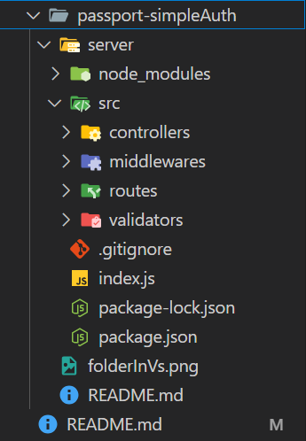

# steps
## project setUp
1. create the passport-simpleAuth folder and navigate to it
```bash
mkdir passport-simpleAuth
cd passport-simpleAuth
```
2. create your server folder and navigate to it
```bash
mkdir server
cd server
```
3. initial node js application
```bash
npm init --yes # to use default settings
```
you will notice `package.json` file has been created
4. now install express framework
```bash
npm i express
```
you will notice a very large folder has been created called `node_modules`
5. create `.gitignore` file and write "node_module" inside
```bash
echo "node_module" > .gitignore
```
6. create `index.js` file
```bash
touch index.js
```
6. create `src` folder and inside it create 4 main folders `contollers`, `middlewares`, `routes`, `validators`
```bash
mkdir src
cd src
mkdir contollers middlewares routes validators
```
7. your project hirerachy should be similar to this
```bash
├─ passport-simpleAuth
├─ README.md
└── server
    ├── index.js
    ├── node_modules
    ├── .gitignore
    ├── package-lock.json
    ├── package.json
    └── src
        ├── controllers
        ├── middlewares
        ├── routes
        └── validators
```


## create server
1. in your index.js file create a simple express server
```js
const express = require('express')
const app = express()
app.listen(3000, () => {
    console.log("i'm listening....")
})
```
2. no create your home route
- open `src/routes` folder and create `home.js` file
- create your home route
```js
const router = require('express').Router()
router.get('/', homeController.getHome)
module.exports = router
```
noticed the `homeController.getHome` ? this is the call back that will get executed whenever we request `/` or home page so let's create it
3. open `src/controllers` and create new controller for home route
```js
class homeController {
    static async getHome(req, res) {
        return res.status(200).json({"message": "from home page"})
    }
}
module.exports = homeController
```
4. now go back to your home route file and require this controller
```js
const homeController = require('../controllers/homeController')
```
5. now go back to your index.js file and require the home route and user it
```js
const homeRoute = require('./src/routes/home')
const app = express()
app.use('/', homeRoute)
```
5. run your index.js file
```bash
node index.js
```

## passport.js implementation and flow


1. **Express Session Establishment**:
   - You start by setting up `express-session` in your application, which is responsible for managing sessions in your app. This allows you to maintain state across different requests.

   ```javascript
   app.use(session({
     secret: 'yourSecretKey', // A secret key for signing the session ID cookie
     resave: false,
     saveUninitialized: false,
   }));
   ```

2. **Initialize Passport**:
   - You call `passport.initialize()` and `passport.session()`, which sets up Passport middleware. This connects Passport with your session management. 

   ```javascript
   app.use(passport.initialize());
   app.use(passport.session());
   ```

3. **Define Routes**:
   - When you define a route, such as `route.post('/login')`, you specify that this route will handle login requests.

   ```javascript
   router.post('/login', (req, res, next) => {
     // Passport authentication will be invoked here
   });
   ```

4. **Invoke `passport.authenticate()`**:
   - Inside the route handler, you call `passport.authenticate('local')`. This function will use the Local Strategy you defined earlier (e.g., using `passport.use(new LocalStrategy(...))`). 

   ```javascript
   passport.authenticate('local', (err, user, info) => {
     // Custom handling after authentication
   })(req, res, next);
   ```

5. **Passport Local Strategy**:
   - The `passport.authenticate('local')` function triggers the logic defined in the Local Strategy, which includes checking the provided credentials (e.g., email and password).
   - Depending on the result of the authentication (success or failure), it will call the `done()` callback.

   ```javascript
   passport.use(new LocalStrategy((email, password, done) => {
     // Logic to find the user and compare passwords
     if (/* user found and password matches */) {
       return done(null, user); // Successful authentication
     } else {
       return done(null, false, { message: 'Incorrect credentials.' }); // Failed authentication
     }
   }));
   ```

6. **Handle the Result in the Route**:
   - After the Local Strategy has executed, the result is passed back to the route handler. You have access to the `err`, `user`, and `info` parameters in the callback function.

   ```javascript
   if (err) {
     return res.status(500).json({ message: 'Internal server error' });
   }
   if (!user) {
     return res.status(401).json({ message: info.message });
   }
   ```

7. **Log the User In**:
   - If authentication is successful, you call `req.logIn(user, ...)`, which sets up the user in the session. This function triggers the serialization process.
   - **Serialization**: The `serializeUser()` function is invoked, where you typically store the user ID (or any other identifying information) in the session.

   ```javascript
   passport.serializeUser((user, done) => {
     done(null, user.id); // Store user ID in session
   });
   ```

8. **Deserialization**:
   - On subsequent requests, Passport will call the `deserializeUser()` function to retrieve the user from the session based on the user ID stored earlier. This function can query your user database or lookup the user from a cache.

   ```javascript
   passport.deserializeUser((id, done) => {
     const user = /* lookup user by id */;
     done(null, user); // User object is attached to req.user
   });
   ```

### Summary of Key Points:

- **Session Establishment**: `express-session` creates a session to maintain state.
- **Passport Initialization**: Connects Passport to the session middleware.
- **Route Handling**: The route for login specifies how to handle login requests.
- **Authentication Process**: `passport.authenticate()` invokes the local strategy to verify user credentials.
- **Callback Handling**: Based on authentication success or failure, you handle the response accordingly.
- **Serialization/Deserialization**: Manage how user information is stored and retrieved from the session.

remember that `done()` is part of the authentication callback within the Local Strategy, and its handling can be customized in the route, leading to the session management via serialization and deserialization. This flow enables Passport to manage user sessions and authentication effectively in your application.