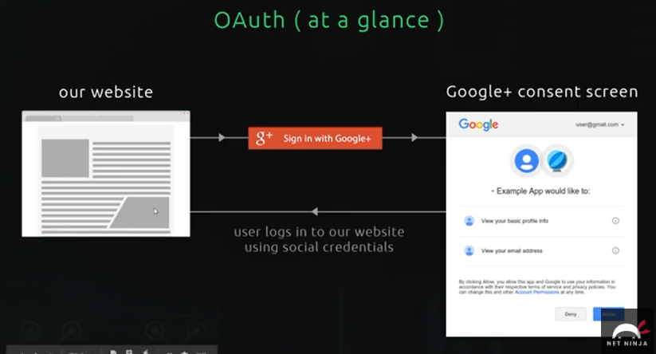
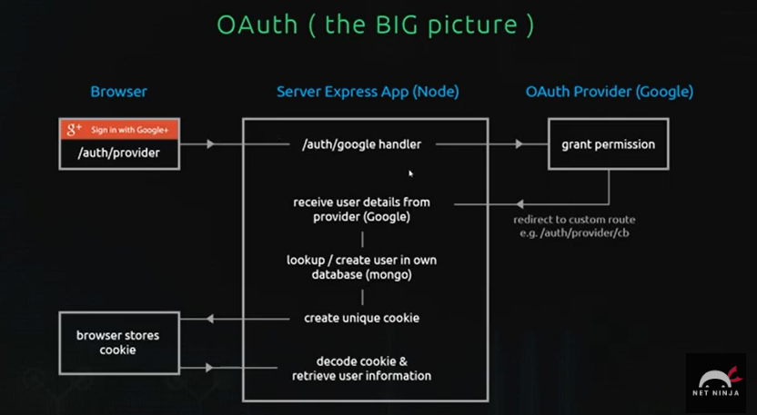

- at first a user visits our website and clicks on the `signIn wiht google` button
- the user will be redirected to google servers to a <mark>consent screen</mark> and this basically google telling the user that our application wants to access his profile so he can signUp to our application with his profile, it will also tell the user what information our application would like to access e:g profile info, email address, etc..
- user choose either to agree or not agree

