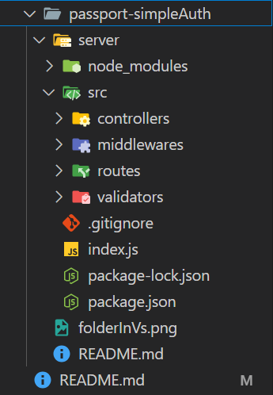

# steps
## project setUp
1. create the passport-simpleAuth folder and navigate to it
```bash
mkdir passport-simpleAuth
cd passport-simpleAuth
```
2. create your server folder and navigate to it
```bash
mkdir server
cd server
```
3. initial node js application
```bash
npm init --yes # to use default settings
```
you will notice `package.json` file has been created
4. now install passport.js and express libraries
```bash
npm i passport express
```
you will notice a very large folder has been created called `node_modules`
5. create `.gitignore` file and write "node_module" inside
```bash
echo "node_module" > .gitignore
```
6. create `index.js` file
```bash
touch index.js
```
6. create `src` folder and inside it create 4 main folders `contollers`, `middlewares`, `routes`, `validators`
```bash
mkdir src
cd src
mkdir contollers middlewares routes validators
```
7. your project hirerachy should be similar to this
```bash
├─ passport-simpleAuth
├─ README.md
└── server
    ├── index.js
    ├── node_modules
    ├── .gitignore
    ├── package-lock.json
    ├── package.json
    └── src
        ├── controllers
        ├── middlewares
        ├── routes
        └── validators
```


## create server
1. in your index.js file create a simple express server
```js
const express = require('express')
const app = express()
app.listen(3000, () => {
    console.log("i'm listening....")
})
```
2. no create your home route
- open `src/routes` folder and create `home.js` file
- create your home route
```js
const router = require('express').Router()
router.get('/', homeController.getHome)
module.exports = router
```
noticed the `homeController.getHome` ? this is the call back that will get executed whenever we request `/` or home page so let's create it
3. open `src/controllers` and create new controller for home route
```js
class homeController {
    static async getHome(req, res) {
        return res.status(200).json({"message": "from home page"})
    }
}
module.exports = homeController
```
4. now go back to your home route file and require this controller
```js
const homeController = require('../controllers/homeController')
```
5. now go back to your index.js file and require the home route and user it
```js
const homeRoute = require('./src/routes/home')
const app = express()
app.use('/', homeRoute)
```
5. run your index.js file
```bash
node index.js
```